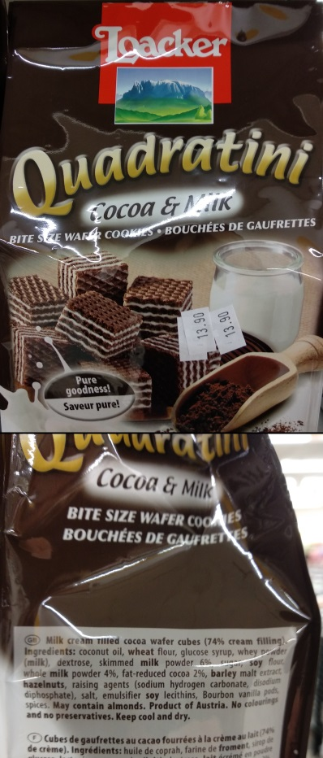

Food Ingredients as Linear Programming
======================================

.. post:: June 21, 2020
   :tags: food, LP
   :category:

I like to know what I'm eating -- even if it's junk -- so I often find myself looking at the ingredients list on the label.

I got a package of choclates had this list of ingredients:

    **Ingredients:** Milk chocolate (58%), nougat (40%), milk fat, coffee extract (0.1%)
    
    -- *A box of chocolates*

How helpful of them to write the percentages for each ingredient! But wait, they put percentage only for the "good" ingredients, but not for the milk fat (what does that even mean?). No matter, I know how to subtract [#f1]_:

.. math::
   \mbox{chocolate} + \mbox{nougat} + \mbox{fat} + \mbox{coffee} &= 100\% \\
   58\% + 40\% + \mbox{fat} + 0.1\% &= 100\% \\
   \mbox{fat} &= 100\% - 58\% - 40\% - 0.1\% \\
   \mbox{fat} &= 1.9\%

Cool, we deduced some information that wasn't given to us directly!

.. image:: food-ingredients/noodles.jpg
   :width: 15em
   :alt: "Professional" noodles
   :align: right

Let's try it again, this time on a package of pre-cooked noodles:

    **Ingredients:** Wheat flour, water, eggs (2%), salt, turmeric
    
    -- *A package of noodles*  

This one is a bit trickier. We know that

.. math::
    \mbox{flour} + \mbox{water} + \mbox{eggs} + \mbox{salt} + \mbox{turmeric} &= 100\% \\
    \mbox{flour} + \mbox{water} + 2\% + \mbox{salt} + \mbox{turmeric} &= 100\% \\
    \mbox{flour} + \mbox{water} + \mbox{salt} + \mbox{turmeric} &= 98\%

Seems we're kind of stuck here...

But maybe we can still do something with this. Food regulations require that the ingredients be listed in a particular order [#f2]_.

    The food components shall be listed in descending order according to their relative content
    in the weight of the product, from the largest content to the smallest content.

    *Source:* `Ministry of Health <https://www.health.gov.il/English/Topics/FoodAndNutrition/Nutrition/Adequate_nutrition/Pages/labeling.aspx>`_

Using this information we also know that

.. math::
    \mbox{flour} \geq \mbox{water} \geq \mbox{eggs} \geq \mbox{salt} \geq \mbox{turmeric} &\geq 0 \\
    \mbox{flour} \geq \mbox{water} \geq 2\% \geq \mbox{salt} \geq \mbox{turmeric} &\geq 0

From all of the above we can deduce that :math:`47\% \leq \mbox{flour} \leq 96\%` and :math:`2\% \leq \mbox{water} \leq 49\%` which is... nice to know, I guess?

I could go over the steps for deducing the wheat content in our noodles, but instead let's jump to the general case.

The Shortest Intro to Linear Programming (LP)
---------------------------------------------

I have to admit that the name is confusing. This sounds like some kind of programming technique, but it is more of an algorithm, or a group of algorithms that solve the same problem. To its defense, it was invented before current-day programming. I guess you could say that it started out as a programming technique.

The gist of LP is that if we format our problem as a `linear optimization problem`, we can use known algorithms to solve it. We don't even need to implement these algorithms, there are many LP solvers freely available. Here we'll use SciPy's `optimize.linprog <https://docs.scipy.org/doc/scipy/reference/generated/scipy.optimize.linprog.html>`_, so we'll work with its input format:

.. math::
    \min_x \ & c^T x \\
    \mbox{such that} \ & A_{ub} x \leq b_{ub},\\
    & A_{eq} x = b_{eq},\\
    & l \leq x \leq u ,

where :math:`x` is a vector of decision variables; :math:`c`,
:math:`b_{ub}`, :math:`b_{eq}`, :math:`l`, and :math:`u` are vectors; and
:math:`A_{ub}` and :math:`A_{eq}` are matrices.

The term :math:`c^T x` is the `cost`, and the inequalities below it are the `constraints`. Our LP solver finds :math:`x` that minimizes the cost while satisfying all the constraints.

In a way, this is a bit like programming, but instead of source code we have matrices, and instead of a compiler we have an LP solver.

Let's work towards getting our problem into the correct form.

Getting to an LP Form
----------------------------

First, let's go over the rules of our game:

1. The amounts are sorted from largest to smallest
2. The sum of all the amounts is 1.0 (that's our 100%, meaning all the ingredients are listed)
3. All the amounts are positive
4. Some amounts are known
5. For the amounts we don't know, we would like to get an upper and lower bound

We'll denote the amounts by the vector :math:`x`.

The first rule says that :math:`x_1 >= x_2 >= \cdots >= x_{n-1} >= x_{n}`. Is this a linear relation? We need to bring it into the form :math:`A_{ub} x <= b_{ub}`, which means changing it into vector notation where all the unknowns to the left-hand side of the inequality. We use :math:`e_i` to denote the vector that has 1 in the :math:`i` th position, and 0 elsewhere.

.. math::
    x_i \geq x_{i+1} \\
    - x_i + x_{i+1} \leq 0 \\
    - e_i x + e_{i+1} x \leq 0 \\
    (- e_i + e_{i+1}) x \leq 0

This applies for :math:`i=1..n-1`. For :math:`n=5` as in our noodles example, the result looks like this [#f3]_:

.. math::
    \begin{pmatrix}
    -1 & 1 & 0 & 0 & 0 \\
    0 & -1 & 1 & 0 & 0 \\
    0 & 0 & -1 & 1 & 0 \\
    0 & 0 & 0 & -1 & 1
    \end{pmatrix}
    \begin{pmatrix}
    x_1 \\
    x_2 \\
    x_3 \\
    x_4 \\
    x_5
    \end{pmatrix}
    \leq
    \begin{pmatrix}
    0 \\
    0 \\
    0 \\
    0
    \end{pmatrix}

Moving on to the second rule, and things are only getting easier. The sum of all the amounts is an obvious linear relation:

.. math::
    \begin{pmatrix}
    1 & 1 & 1 & 1 & 1
    \end{pmatrix}
    \begin{pmatrix}
    x_1 \\
    x_2 \\
    x_3 \\
    x_4 \\
    x_5
    \end{pmatrix}
    =
    1

This is the first row of our :math:`A_{eq} x = b_{eq}` relationship. We need to add more rows to :math:`A_{eq}`, and we'll come back to it a bit later.

Next, all the amounts are positive. This sounds trivial, but it's important. Without it we can barely deduce anything, and we would get wrong answers. We could model this in a matrix relation, but that's not needed. The SciPy implementation has support for lower and upper bounds. We just set :math:`l = 0, u = 1`.

Now for the known amounts. Even easier, this one. If :math:`x_i` is known to be equal to :math:`v_i`, then we have

.. math::
    e_i x_i = v_i

We take all these, and the equation for the sum of the values, and put them all in a single matrix (each equation is a row). For our noodles example, we have a row for the some of all the amounts, and a row for the known amount for :math:`x_3`:

.. math::
    \begin{pmatrix}
    1 & 1 & 1 & 1 & 1 \\
    0 & 0 & 1 & 0 & 0 \\
    \end{pmatrix}
    \begin{pmatrix}
    x_1 \\
    x_2 \\
    x_3 \\
    x_4 \\
    x_5
    \end{pmatrix}
    =
    \begin{pmatrix}
    1 \\
    0.02
    \end{pmatrix}

Lastly, we want to find out the maximal and minimal possible amounts for one of the ingredients. If we're interested in the minimal amount for ingredient :math:`i`, we want to

.. math::
    \mbox{minimize } e_i x

And if we want to find the maximal amount for it,

.. math::
    \mbox{minimize } (-e_i) x

That's it! Let's put all that into code, and let SciPy do the hard work of actually solving it.

Coding the LP
-------------

You can find the code `here <https://github.com/tomerv/food-ingredients>`_. It's not that interesting, so I won't go into it.

The implementation uses NumPy matrices. I tried sparse matrices as well, but it was slower. This is probably due to the small size of the matrix, usually no larger than 10x10. For these sizes, the overhead of using a sparse matrix is larger than the savings.

I also wanted to give it a simple GUI to make it easier to use. I put it in a Jupyter Notebook with some input widgets for the names and values of the ingredients. It has a nicer interface, but it's less flexible. You can run it `on mybinder.org <https://mybinder.org/v2/gh/tomerv/food-ingredients/master?filepath=src%2Fmain.ipynb>`_.

We can see check that the code give correct bounds for our noodles:

::

    $ python src/main.py data/noodles.txt
    wheat flour:          47.00% - 96.00%
    water:                 2.00% - 49.00%
    eggs:                       2.00%
    salt:                  0.00% -  2.00%
    turmeric:              0.00% -  2.00%

We can also try it out on some other real foods sold in the supermarket in Israel.

Here is Nutella:

::

    $ python src/main.py data/nutella.txt
    sugar:                28.05% - 57.90%
    vegetable oil:        13.00% - 35.45%
    hazelnut:                  13.00%
    skim milk powder:           8.70%
    low fat cocoa powder:        7.40%
    soy lecithin:          0.00% -  7.40%
    flavorings:            0.00% -  7.40%

The label emphasizes the hazelnut, milk, and cocoa content. But we still got non-trivial lower and upper bounds on the sugar content. I wonder how much sugar it really has...

Still in the candy section, we have Quadratini:

::

    $ python src/main.py data/quadratini.txt
    coconut oil:          12.40% - 56.00%
    wheat flour:           6.00% - 31.00%
    glucose syrup:         6.00% - 22.67%
    whey powder:           6.00% - 18.50%
    dextrose:              6.00% - 16.00%
    skimmed milk powder:        6.00%
    sugar:                 4.00% -  6.00%
    soy flour:             4.00% -  6.00%
    whole milk powder:          4.00%
    fat-reduced cocoa:          2.00%
    barley malt extract:   0.00% -  2.00%
    hazelnuts:             0.00% -  2.00%
    raising agents:        0.00% -  2.00%
    salt:                  0.00% -  2.00%
    emulsifier soy lecithins:   0.00% -  2.00%
    Bourbon vanilla pods:   0.00% -  2.00%
    spices:                0.00% -  2.00%

Lots of ingredients here, and we're only given quantities to a few of them. But we can still deduce a minimal amount of 12.4% coconut oil!

I tried many items. Some give interesting results, and some don't. You're welcome to try on your own.

Summary
-------

Linear Programming is one of those things I encountered many times (including in 3 different university courses!) but never had a chance to apply.  New I can consider that task as "done". I got to use scipy's LP solver, tried out sparse matrices, and played a bit with Jupyter widgets.

As for the results, the most interesting cases are when a "bad" ingredient is first and the "good" ingredient has a low amount, like in the case of Nutella. This combination gives us a non-trivial lower bound for the bad ingredient.

Lastly, if I had to change one rule for the label on the packaging, I would force all manufacturers to give exact amounts for every ingredient that's over 1%. It would make my code useless, but it would make consumers' life better.

.. rubric:: Footnotes

.. [#f1] I used a calculator for this.
.. [#f2] I'm refering to the local law in my country, but I assume it's the same in most. The FDA is similar, see https://www.accessdata.fda.gov/scripts/cdrh/cfdocs/cfcfr/cfrsearch.cfm?fr=101.4
.. [#f3] This shows that "the list is sorted" is a linear relationship.
